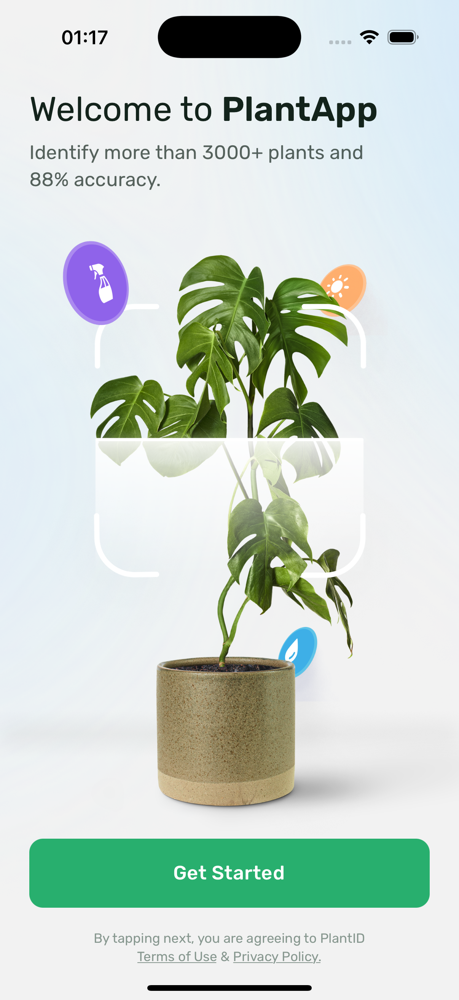
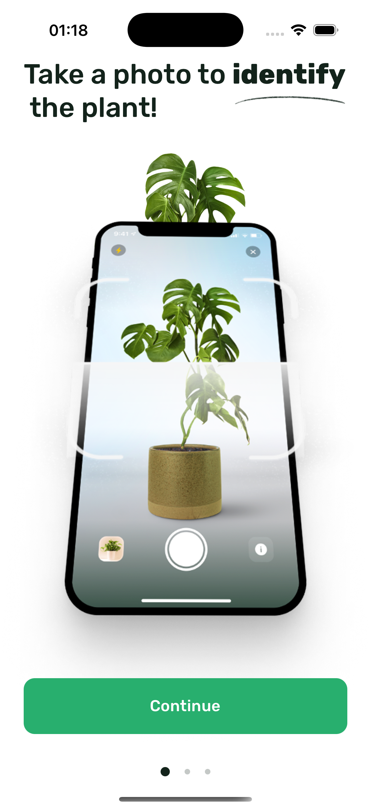
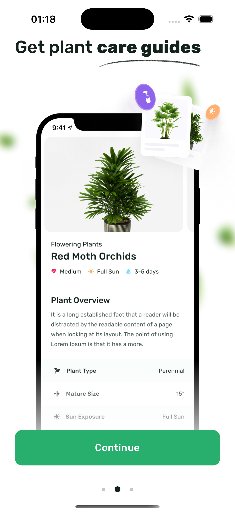
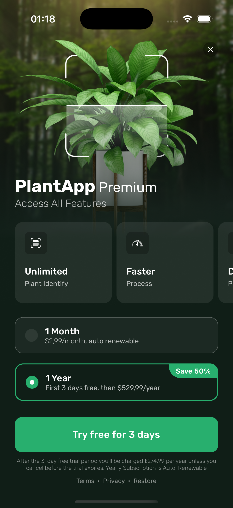
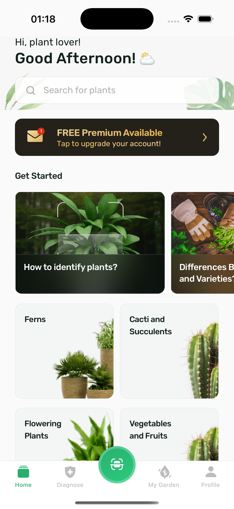

# PlantAppCase - Case Study 🪴

   

This repository contains the source code for PlantAppCase, a React Native mobile application developed as a case study.

## ✨ Features

*   **Onboarding Flow:**
    *   **Get Started Screen:** Initial welcome screen.
    *   **Multi-Step Onboarding:** Introduces core features (Identify, Care Guides) with visual aids and pagination.
    *   **Paywall Screen:** Presents premium subscription options with feature highlights.
*   **Main Application (Tab-Based Navigation):**
    *   **Home Screen:** Displays dynamic content including greetings, search, premium promotion banner, "Get Started" questions (fetched from API), and categorized content (fetched from API).
    *   **Diagnose Screen:** (Placeholder) Intended for plant disease diagnosis features.
    *   **Scan Screen:** (Placeholder UI, but functional navigation) Central action button to initiate plant scanning/identification.
    *   **My Garden Screen:** (Placeholder) Intended for users to manage their collection of plants.
    *   **Profile Screen:** (Placeholder) Intended for user account settings and information.
*   **State Management:** Utilizes Redux Toolkit for managing application state, including asynchronous data fetching for categories and questions.
*   **API Integration:** Fetches data (categories, questions) from a dummy backend API using Axios.
*   **Custom UI Components:** Includes reusable custom elements (`Button`, `Icon`, `GradientText`, `UnderlinedText`) and components (`PaginationDots`, `ScanBottomButton`, `QuestionCard`, `CategoryCard`).
*   **Styling:** Uses React Native `StyleSheet` with utility functions for responsive scaling (`smartScale`, `verticalScale`).
*   **Navigation:** Implements stack navigation for the onboarding flow and bottom tab navigation for the main app using React Navigation. Features a custom central tab button.
*   **Persistence:** Uses AsyncStorage to track onboarding completion status.

## 📸 Screenshots / GIFs

| Get Started                 | Onboarding 1                | Onboarding 2                |
| :--------------------------: | :--------------------------: | :--------------------------: |
|  |  |  |

| Paywall                     | Home Screen                 | In App GIF              |
| :--------------------------: | :--------------------------: | :--------------------------: |
|  |  |  |

## 🛠️ Tech Stack

*   **Core:** React Native 0.79.1, React 19, TypeScript
*   **Navigation:** React Navigation (Native Stack, Bottom Tabs)
*   **State Management:** Redux Toolkit, React-Redux
*   **API Client:** Axios
*   **UI Components:**
    *   React Native Vector Icons (IcoMoon)
    *   React Native Linear Gradient
    *   React Native SVG
    *   React Native Masked View
    *   React Native Safe Area Context
    *   React Native Gesture Handler
*   **Persistence:** Async Storage

## 📂 Project Structure

The project follows a standard React Native structure with key directories organized under `src/`:

PlantAppCase/
├── src/
│ ├── assets/ # Static assets (fonts, images, icons)
│ ├── components/ # Reusable composite UI components (e.g., CategoryCard)
│ ├── elements/ # Basic, reusable UI elements (e.g., Button, Icon)
│ ├── navigation/ # Navigation setup (Stack, Tabs, Routers)
│ ├── pageContainers/ # Logic containers for screens
│ ├── pages/ # Application screens/views
│ ├── store/ # Redux store, slices, and actions
│ ├── utils/ # Utility functions (e.g., scaling)
│ ├── appSettings.ts # Global application settings/constants
│ └── request.ts # Axios instance configuration
├── ios/ # iOS native project
├── android/ # Android native project
├── vendor/ # Bundler path for Gems
├── App.tsx # Root application component
├── index.js # App entry point
├── package.json # Project dependencies and scripts
├── tsconfig.json # TypeScript configuration
├── babel.config.js # Babel configuration (with module-resolver aliases)
├── Gemfile # Ruby gem dependencies (for Cocoapods)
└── ... # Other configuration files (.eslintrc, .prettierrc, etc.)

Path aliases are configured in `babel.config.js` and `tsconfig.json` for cleaner imports (e.g., `src/`, `pages/`, `elements/`).

## 🚀 Getting Started

### Prerequisites

*   Node.js (>= 18) and npm/Yarn
*   Ruby and Bundler (for Cocoapods)
*   React Native development environment set up (Xcode for iOS, Android Studio for Android). Follow the official [React Native Environment Setup guide](https://reactnative.dev/docs/environment-setup) (choose "React Native CLI Quickstart").

### Installation

1.  **Clone the repository:**
    ```bash
    git clone https://github.com/erdemozk/PlantAppCase.git
    cd PlantAppCase
    ```

2.  **Install Node.js dependencies:**
    ```bash
    npm install
    # or
    yarn install
    ```

3.  **Install iOS Pods:**
    ```bash
    cd ios
    pod install
    cd ..
    ```

### Running the App

*   **To run on iOS:**
    ```bash
    npm run ios
    # or
    yarn ios
    ```
    (Requires macOS and Xcode)

*   **To run on Android:**
    ```bash
    npm run android
    # or
    yarn android
    ```
    (Requires Android Studio and an emulator or connected device)

*   **Start Metro Bundler (if needed separately):**
    ```bash
    npm start
    # or
    yarn start
    ```
